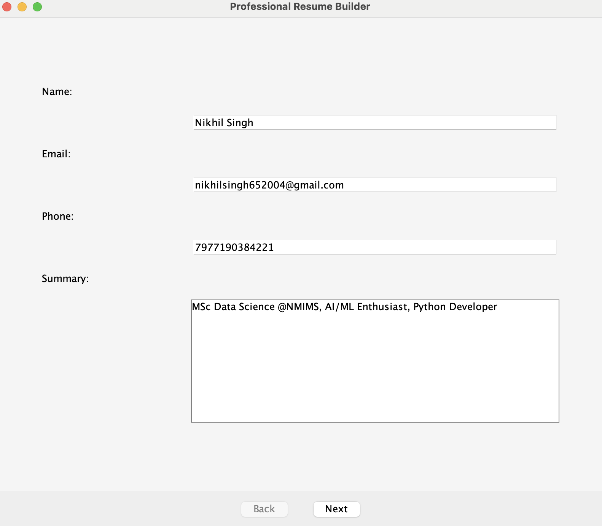
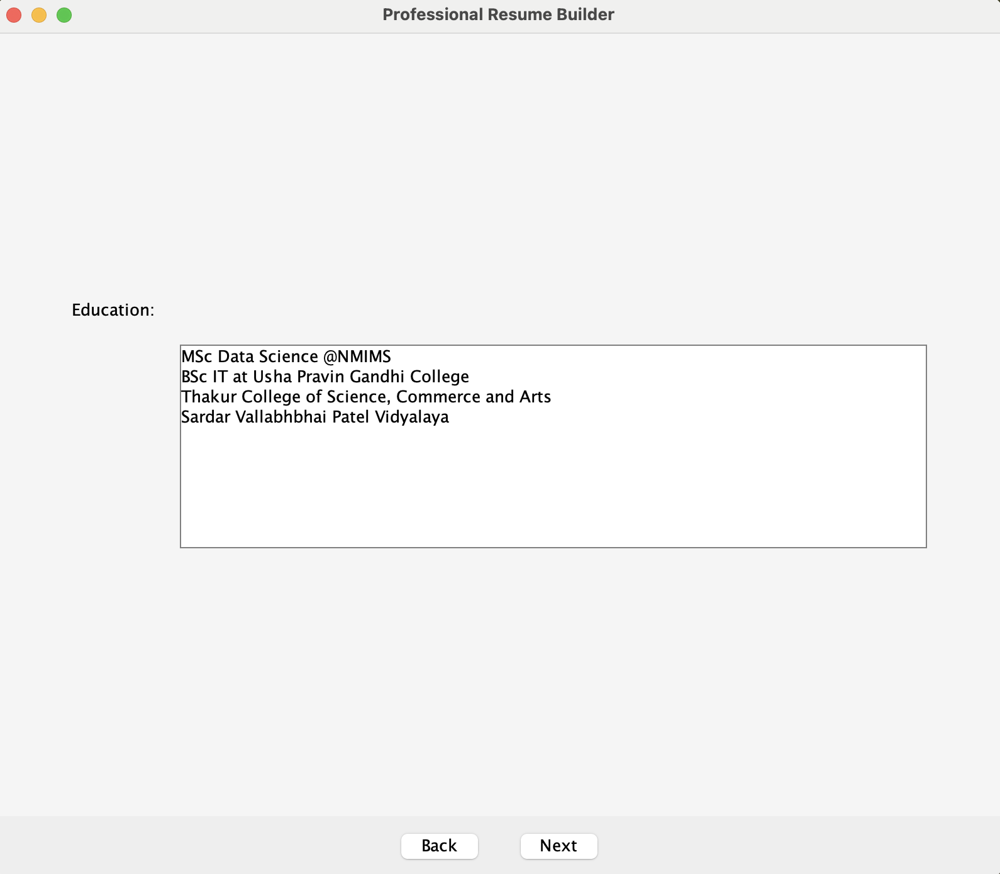
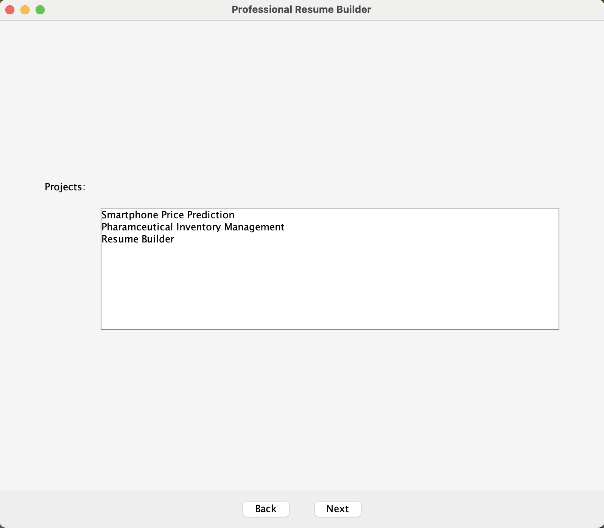
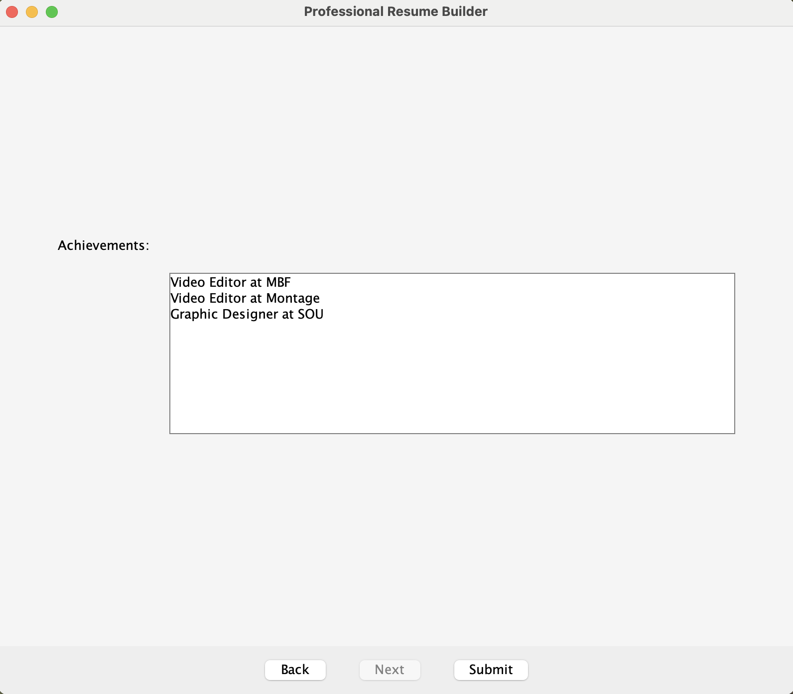

# 📄 Resume Builder – Desktop Application using Java Swing

Resume Builder is a desktop application that allows users to create professional resumes by entering basic personal, educational, and professional details. The app generates a PDF resume instantly with a clean and elegant design.

---

## 📂 Features

- Input personal information (Name, Contact, Email, etc.)
- Add education, work experience, and skills
- Choose a sleek **purple-themed UI**
- Generate and download resume as **PDF**
- Simple, user-friendly interface for beginners

---

## 💻 Technologies Used

- **Java** (Core)
- **Java Swing** (GUI)
- **iTextPDF** (PDF generation)

---
##✅Output Screenshots

## 🚀 How to Run

1. Clone the repository:
   git clone [<repository-url>](https://github.com/tstnikhil4356/ResumeBuilder-with-Java-Swing)
2.Open the project in IntelliJ IDEA or any Java IDE
Add iTextPDF.jar to your project libraries
Compile and run ResumeBuilder.java
Fill in your details and click Generate PDF
🖼 Screenshots
🟣 Main Form
📄 Sample Generated Resume
🙋‍♂️ Author
Nikhil Singh
📧 nikhilsingh652004@gmail.com
GitHub: https://github.com/tstnikhil4356
LinkedIn: https://www.linkedin.com/in/nikhil-singh-b8b559237/
